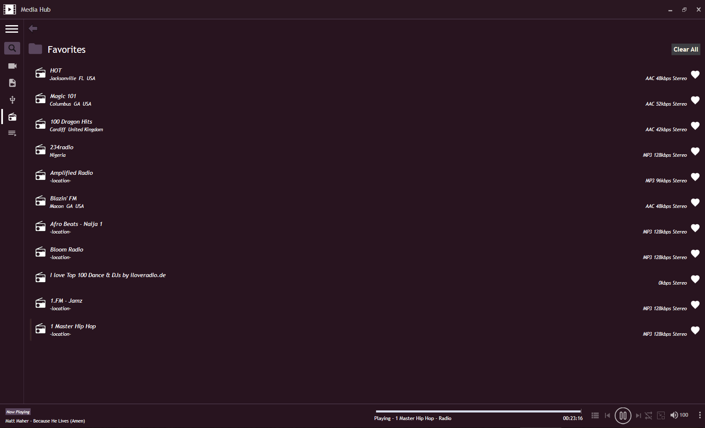

# Movie Hub
Movie Hub is a desktop application used to play and organise your locally stored movies.

### Features

- Codec based on VLC codec.
- Internet radio with 2000 stations available.
- Themes.

### Prerequisites
Windows requirement .Net Framework >= 4.0
## Set Up
You can download the setup with the link below:
* https://drive.google.com/open?id=1yhGXXDOcIp7XAJoDtF08eaEeUoWq0Hfr

## Built With
* https://my.visualstudio.com/Downloads?q=visual%20studio%202010&wt.mc_id=o~msft~vscom~older-downloads

## Contributing
## Authors
* **Ezeudoh Tochukwu** - *Initial work* - [Ezeudoh Edwin](https://github.com/eadwinCode)
See also the list of [contributors](https://github.com/your/project/contributors) who participated in this project.

## License
This project is licensed under the MIT License - see the [LICENSE.md](LICENSE.md) file for details
## Preview

